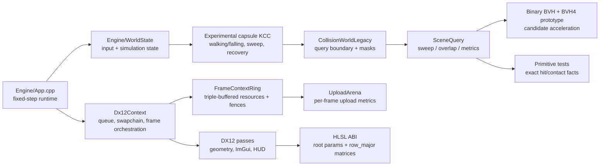
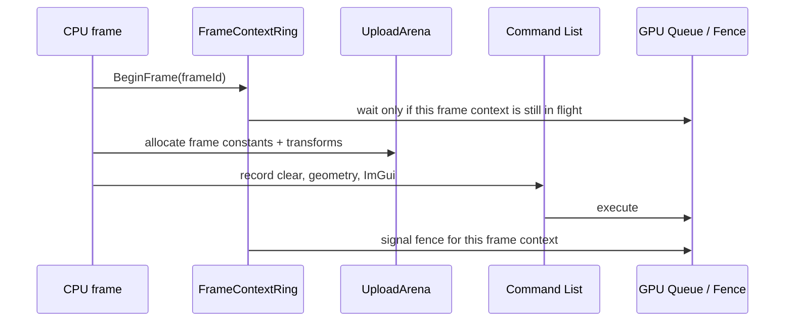
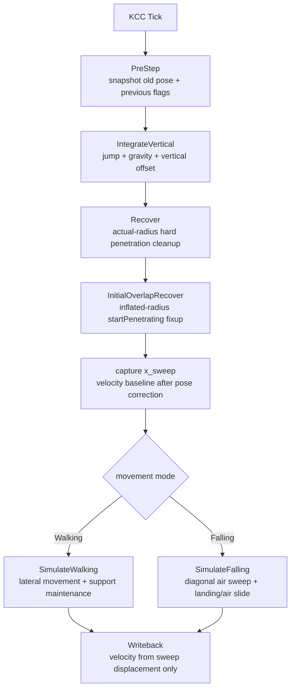
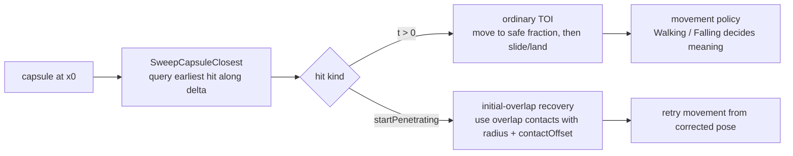
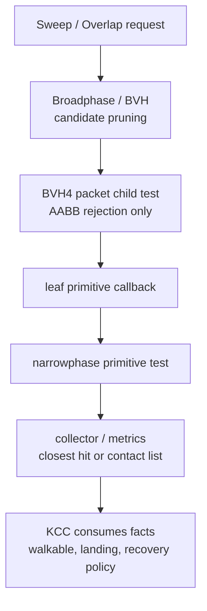
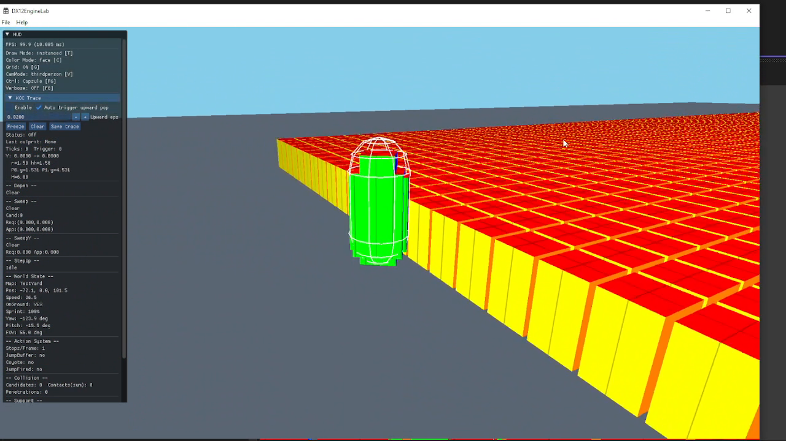

# DX12EngineLab

**C++17 / DirectX12 engine lab for explicit GPU resource lifetime, real-time
rendering diagnostics, and custom collision / KCC systems.**

DX12EngineLab is a Windows / DirectX12 engine sandbox built around two hard
engineering threads:

1. making low-level rendering lifetime visible and debuggable; and
2. building enough collision / SceneQuery infrastructure to reason about capsule
   character movement bugs instead of treating them as black-box physics.

**Demo capture:** [Watch the 60s 720p MP4](assets/media/demo-full.mp4)

> Public README target: add `assets/media/demo-main.png` or
> `assets/media/demo-main.gif` above this line before the final GitHub link is
> shared. The current MP4 is the full capture; a thumbnail/GIF will make the
> first screen read more like an engine demo and less like a document.



## What This Project Shows

| Area | What is demonstrated | Evidence |
|---|---|---|
| DX12 frame lifetime | triple-buffered frame contexts, command allocator reuse, fence ownership | `Renderer/DX12/FrameContextRing.*`, `Renderer/DX12/Dx12Context.*` |
| GPU resource ownership | UploadArena metrics, descriptor ring reuse, resource-state tracking | `Renderer/DX12/UploadArena.*`, `Renderer/DX12/DescriptorRingAllocator.*`, `Renderer/DX12/ResourceStateTracker.*` |
| Shader / CPU contract | root parameter enum mirrored by HLSL registers, explicit `row_major` matrices | `Renderer/DX12/ShaderLibrary.h`, `shaders/common.hlsli` |
| Real-time demo path | 10,000-cube instancing / naive draw toggle, ImGui HUD, runtime controls | `Renderer/DX12/GeometryPass.h`, `Renderer/DX12/ToggleSystem.h`, `Renderer/DX12/ImGuiLayer.*` |
| Runtime systems | fixed-step simulation, action state, camera/runtime HUD data | `Engine/App.cpp`, `Engine/WorldState.*`, `Renderer/DX12/Dx12Context.h` |
| Collision / KCC depth | capsule KCC, sweep/slide, initial-overlap recovery, walking/falling split | `Engine/Collision/KinematicCharacterControllerLegacy.*`, `Engine/Collision/CctTypes.h` |
| SceneQuery / BVH direction | closest sweep, overlap contacts, deterministic metrics, BVH4 packet child-test prototype | `Engine/Collision/SceneQuery/`, `docs/audits/scenequery/` |

This is not presented as a production engine. The point is to show engine-system
ownership: explicit GPU lifetime on the rendering side, and evidence-driven
collision contracts on the runtime side.

## Engineering Problems And Solutions

### 1. Explicit GPU frame lifetime

DirectX12 does not hide command allocator, upload-buffer, descriptor, or resource
state lifetime. This repo makes those boundaries explicit instead of relying on
a framework.

| Problem | Local solution | Evidence |
|---|---|---|
| Reusing a command allocator before the GPU is finished corrupts frame state. | `FrameContextRing` selects frame resources by monotonic frame id and gates reuse with fences. | `Renderer/DX12/FrameContextRing.h`, `Renderer/DX12/FrameContextRing.cpp` |
| Per-frame upload allocation is easy to misuse if it is invisible. | `UploadArena` records allocation calls, bytes, peak offset, capacity, and last allocation tag for HUD diagnostics. | `Renderer/DX12/UploadArena.h`, `Renderer/DX12/UploadArena.cpp` |
| Dynamic descriptors need a clear lifetime owner. | `DescriptorRingAllocator` owns shader-visible descriptor reuse and retirement. | `Renderer/DX12/DescriptorRingAllocator.*` |
| Resource barriers become noisy and error-prone when spread across passes. | `ResourceStateTracker` centralizes state transitions and skips redundant barriers. | `Renderer/DX12/ResourceStateTracker.*`, `Renderer/DX12/BarrierScope.h` |



### 2. Shader ABI as an engine contract

The renderer treats CPU root parameters and HLSL registers as an ABI. The shader
side documents the root slots and uses `row_major` matrices so CPU-side matrix
layout does not depend on implicit transpose assumptions.

| CPU side | HLSL side | Purpose |
|---|---|---|
| `RP_FrameCB` | `b0 space0` | frame constants, including `ViewProj` |
| `RP_TransformsTable` | `t0 space0` | transform `StructuredBuffer` descriptor table |
| `RP_InstanceOffset` | `b1 space0` | root constant for naive draw instance offset |
| `RP_DebugCB` | `b2 space0` | debug color mode constants |

Evidence: `Renderer/DX12/ShaderLibrary.h`, `shaders/common.hlsli`.

### 3. KCC bug work as engine-system debugging

The collision work started from visible gameplay symptoms: seam/corner contacts,
wall-climb-like upward pops, jump/landing instability, and near-zero sweep hits.
The valuable part is not that the KCC is "done"; it is that the project now
separates movement policy, raw query facts, and recovery semantics more clearly.



Important KCC contracts currently documented in source:

- recovery corrections are pose-only and must not feed into velocity:
  `Engine/Collision/KinematicCharacterControllerLegacy.cpp`
- `InitialOverlapRecover` is event-scoped and only handles `startPenetrating`
  sweep cases, not ordinary floor/support cleanup:
  `Engine/Collision/KinematicCharacterControllerLegacy.cpp`
- falling landing is not identical to walking support maintenance:
  `docs/reference/unreal/contracts/floor-find-perch-edge.md`
- larger KCC work is intentionally deferred until a concrete repro returns:
  `docs/audits/kcc/13-post-initial-mtd-remaining-work.md`

Safe portfolio wording:

> Built and instrumented an experimental capsule KCC / SceneQuery subsystem and
> fixed visible wall-climb/upward-pop cases by separating sweep hits, initial
> overlap recovery, and pose-only correction semantics.

Unsafe wording:

> Production-grade character controller.

### 4. Sweep, initial overlap, and MTD-like recovery

A sweep asks: "if this capsule moves along this direction, what is the earliest
time of impact?" A useful mental model is to reason about a moving point against
geometry inflated by the capsule shape, often described through Minkowski-sum or
CSO vocabulary in continuous collision detection material.

That mental model is used here to explain the contract, not to claim that every
local primitive path is a generic GJK implementation. The local code is a
SceneQuery system over explicit primitive tests, BVH traversal, and overlap
contacts.



The hard lesson from the KCC work is that not all normals mean the same thing:

| Normal / result kind | Meaning | Who should consume it |
|---|---|---|
| sweep TOI normal | blocking surface reached during motion | movement stage, slide, landing check |
| initial-overlap result | movement started inside inflated contact band | recovery path, not slide/landing |
| overlap contact normal | current penetration/support fact | recovery or floor support, not ordinary sweep TOI |
| walkable floor normal | candidate ground slope | floor/landing policy, not raw SceneQuery |

PhysX reference cards in `docs/reference/physx/contracts/` are used to keep the
low-level geometry contracts honest:

- `sweep-toi-hit-normal.md`: split ordinary sweep distance from initial-overlap
  and MTD reporting semantics.
- `initial-overlap-mtd.md`: keep public penetration depth and sweep MTD
  conventions separate.
- `scenequery-pipeline.md` and `query-filtering.md`: keep raw query mechanics
  separate from higher-level movement policy.

Unreal reference cards in `docs/reference/unreal/contracts/` are used for
movement policy, not low-level geometry:

- `floor-find-perch-edge.md`: floor is more than `normal.y`; it carries distance,
  walkability, edge/perch, source, and valid-landing semantics.
- `character-movement-walking-floor-step.md`: walking, floor maintenance, step,
  and landing are policy layers above raw collision facts.

Conceptual collision-detection background is treated separately from code
evidence. Erin Catto's Box2D publications are useful for TOI / shape-cast /
Minkowski-sum vocabulary and ghost-collision intuition, but they are not used as
proof that this 3D capsule KCC has Box2D behavior.

### 5. Reference-backed collision engineering

The collision work was guided by three reference layers:

1. production engine source for behavior contracts,
2. collision-detection books and papers for geometric vocabulary, and
3. local EngineLab audits for what is actually implemented.

The goal is not to copy a physics engine. The useful output is a smaller set of
EngineLab contracts: raw query facts, movement policy, deterministic hit
reduction, and pose-only recovery.

| Reference area | What I used it for | Local translation |
|---|---|---|
| PhysX `GeometryQuery` / CCT source | sweep result semantics, initial overlap, MTD, contact offset | `startPenetrating` is routed to `InitialOverlapRecover`, not consumed as slide or landing |
| Unreal `CharacterMovement` source | floor finding, valid landing, walkable floor, perch/edge policy | Walking support and Falling landing are treated as separate movement-policy problems |
| Christer Ericson, *Real-Time Collision Detection* | primitive tests, closest points, broadphase/narrowphase vocabulary | `SceneQuery` separates candidate acceleration from primitive-level hit/contact facts |
| Gino van den Bergen / GJK literature | support mapping, Minkowski difference, convex proximity vocabulary | used as future convex-query direction; not claimed as a full implemented GJK backend |
| Erin Catto GDC / Box2D collision material | TOI, shape cast, contact manifold, ghost-collision intuition | helped define sweep/TOI vs overlap/recovery semantics and near-degenerate contact debugging |
| PhysX BV4 source | BVH4 as candidate acceleration, not final collision policy | local BVH4 packet child-test prototype keeps collector semantics shared with scalar traversal |

In short: PhysX is used for low-level geometry-query contracts, Unreal is used
for movement-policy separation, and books/GDC material provide the geometric
language for explaining why sweep hits, overlap contacts, floor support, and MTD
must not be collapsed into one "collision normal."

### 6. SceneQuery and BVH4 direction

`SceneQuery` is the local boundary for raw geometric facts. The goal is to keep
candidate acceleration separate from final movement policy.



What has been implemented or instrumented:

- `SweepCapsuleClosestHit_Fast` and `OverlapCapsuleContacts_Fast` over the
  SceneQuery backend: `Engine/Collision/SceneQuery/SqQueryLegacy.h`
- BVH4 scalar and packet child-test entry points:
  `Engine/Collision/SceneQuery/SqBVH4.h`
- backend equivalence and metrics harness:
  `Engine/Collision/SceneQuery/SqBackendHarness.*`
- documented claim boundary for SIMD/SoA work:
  `docs/audits/scenequery/12-bvh4-simd-soa-traversal-hardening.md`

Allowed claim:

> Hardened a BVH4 packet child-test prototype so scalar and packet traversal
> share collector semantics while exposing packet-lane metrics.

Disallowed claim:

> Implemented PhysX BV4 or proved SIMD speedup.

## Demo Evidence

Current curated media:

- `assets/media/demo-full.mp4`: 1280x720, 16:9, about 63 seconds.

Recommended public media before sharing the final GitHub link:

- `assets/media/demo-main.png`: first-frame or composed 16:9 thumbnail.
- `assets/media/demo-main.gif`: 8-15 second loop showing 10,000 cubes, HUD,
  draw-mode toggle, and character movement.
- `assets/media/hud-uploadarena.png`: close-up HUD proof of UploadArena metrics.

Suggested final layout once the thumbnail exists:

```md
[](assets/media/demo-full.mp4)
```

## Controls

| Key | Behavior |
|---|---|
| `T` | Toggle instanced / naive draw mode |
| `U` | Toggle UploadArena diagnostics |
| `C` | Cycle color mode |
| `G` | Toggle grid |
| `V` | Toggle camera mode |
| `WASD` | Move |
| `Shift` | Sprint |
| `Space` | Jump |
| `F10` | Toggle capsule wireframe debug visualization |

## Build And Run

### Requirements

- Windows
- Visual Studio 2022
- Windows SDK
- DirectX 12 capable GPU/driver

### Build

```bash
msbuild DX12EngineLab.sln /m /p:Configuration=Debug /p:Platform=x64
msbuild DX12EngineLab.sln /m /p:Configuration=Release /p:Platform=x64
```

`.github/workflows/build.yml` runs Debug and Release x64 builds on
`windows-latest` for push and pull request events. Do not treat this README as a
fresh local build result unless the commands above or CI were actually run for
the current commit.

### Run

Open `DX12EngineLab.sln`, select `x64 / Debug`, and run with F5.

## Repository Map

| Path | Purpose |
|---|---|
| `Renderer/DX12/` | DX12 renderer, frame contexts, descriptors, resource states, passes, and diagnostics |
| `shaders/` | HLSL shaders and shared root-signature ABI documentation |
| `Engine/` | app loop, fixed-step runtime, world state, math, and collision integration |
| `Engine/Collision/` | experimental capsule KCC, CollisionWorld, SceneQuery, BVH, primitive tests |
| `Engine/Collision/SceneQuery/` | sweep/overlap query paths, metrics, BVH4 prototype, backend harness |
| `assets/scenes/` | runtime scene data |
| `assets/media/` | curated public demo media |
| `docs/onboarding/` | renderer architecture and frame-lifecycle notes |
| `docs/reference/physx/` | reviewed PhysX contract cards, not copied production code |
| `docs/reference/unreal/` | reviewed Unreal movement-policy contract cards |
| `docs/audits/` | local audit reports and deferred-work records |

## Evidence Artifacts

| Topic | Evidence |
|---|---|
| frame lifecycle | `docs/onboarding/20-frame-lifecycle.md`, `Renderer/DX12/FrameContextRing.*` |
| resource ownership | `docs/onboarding/30-resource-ownership.md`, `Renderer/DX12/ResourceStateTracker.*` |
| shader binding ABI | `docs/onboarding/40-binding-abi.md`, `shaders/common.hlsli` |
| UploadArena | `docs/onboarding/50-uploadarena.md`, `Renderer/DX12/UploadArena.*` |
| KCC stop point | `docs/audits/kcc/13-post-initial-mtd-remaining-work.md` |
| PhysX sweep / MTD semantics | `docs/reference/physx/contracts/sweep-toi-hit-normal.md`, `docs/reference/physx/contracts/initial-overlap-mtd.md` |
| PhysX CCT query/recovery mechanics | `docs/reference/physx/contracts/cct-query-recovery-mechanics.md` |
| PhysX BV4 traversal boundary | `docs/reference/physx/contracts/bv4-layout-traversal.md`, `docs/audits/scenequery/12-bvh4-simd-soa-traversal-hardening.md` |
| Unreal floor / perch / landing policy | `docs/reference/unreal/contracts/floor-find-perch-edge.md`, `docs/reference/unreal/contracts/character-movement-walking-floor-step.md` |

## Known Limitations

- This is an engine lab, not a production engine.
- Collision/KCC code is experimental and still being refined.
- The current public demo is an engine-system capture, not complete game
  content.
- BVH4/SIMD work is a correctness and metrics harness. It is not a claim of
  PhysX BV4 parity or proven runtime speedup.
- Floor/perch/edge semantics are documented as future KCC work, not complete
  behavior.
- Raw reference forks, prompt logs, GPT logs, private portfolio drafts, and PDFs
  should not be exposed as the public GitHub surface.

## Roadmap

Short term:

- Add `demo-main.png` and `demo-main.gif` for the first README viewport.
- Keep README claims tied to source paths and current demo artifacts.
- Keep collision claims honest: experimental KCC, not production physics.

Engine work:

- Expand deterministic SceneQuery benchmark cases before making performance
  claims.
- Resume KCC work only from concrete repro traces.
- Continue floor/perch/landing refinement as a separate movement-policy lane.
- Treat BVH4 flattening, quantization, and deeper SIMD work as separate sessions,
  not one mixed refactor.
