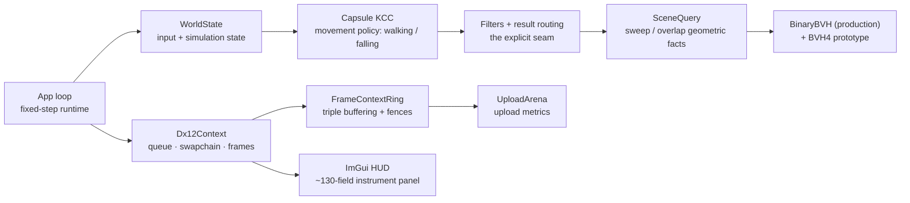
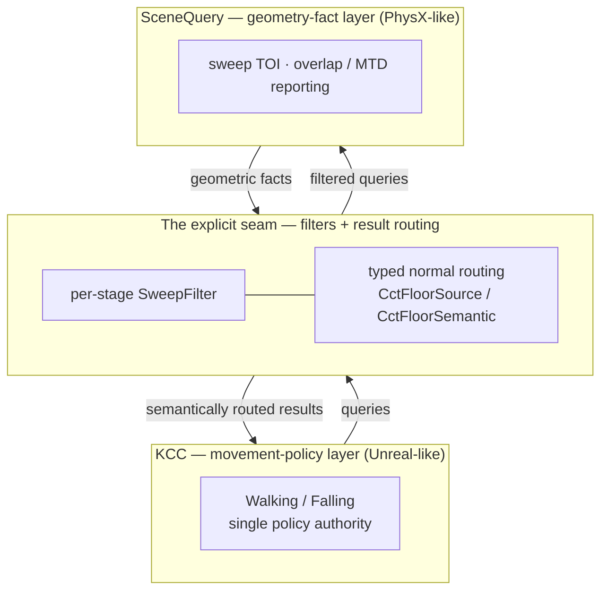

# DX12EngineLab

[](https://github.com/daekuelee/DX12EngineLab/actions/workflows/build.yml)

**C++17 / DirectX12 / HLSL engine lab — explicit GPU frame lifetime on the rendering
side, and a character-movement & collision stack (kinematic character controller +
scene query) rebuilt on pinned semantics on the simulation side.**

~21,000 lines of own code · Jan–May 2026 · CI Debug+Release matrix · 181 tracked design & audit documents

> **Abstract.** A solo engine lab built around one conviction: *engine claims should be
> provable by instruments, not asserted.* On the rendering side, every GPU lifetime
> boundary — allocators, uploads, descriptors, resource states — has
> [one named owner, gated by fences](#explicit-gpu-frame-lifetime), observable in a
> [~130-field HUD with fault injection proving the protection is real](#debugging-with-instruments).
> On the simulation side, a character controller assembled from Bullet, Unreal, and PhysX
> semantics [collapsed at their implicitly mixed
> boundaries](#the-collision-stack-from-semantic-collapse-to-explicit-seams) — and
> was rebuilt by [mining both engines into contract cards](#mining-two-engines-into-contracts)
> and making the mixture explicit, with a
> [genuine Minkowski (CSO) narrowphase](#the-math-a-genuine-cso-narrowphase) cross-checked
> by [four query backends against a linear oracle](#four-backends-one-oracle-the-correctness-harness).

[](assets/media/demo-full.mp4)

Inline 14s loop from the engine demo — edge contact, character movement, HUD
diagnostics, SceneQuery/KCC debug visualization. Full capture: [60s 720p MP4](assets/media/demo-full.mp4).

## Architecture at a Glance

Two spines meet at a fixed-step app loop. The simulation spine is about separating
movement policy from geometric fact; the rendering spine is about owning frame
lifetime explicitly. Every box is a file you can open.


```mermaid
flowchart LR
    App["App loop<br/>fixed-step runtime"] --> World["WorldState<br/>input + simulation state"]
    World --> KCC["Capsule KCC<br/>movement policy: walking / falling"]
    KCC --> Seam["Filters + result routing<br/>the explicit seam"]
    Seam --> SQ["SceneQuery<br/>sweep / overlap geometric facts"]
    SQ --> BVH["BinaryBVH (production)<br/>+ BVH4 prototype"]
    App --> DX12["Dx12Context<br/>queue · swapchain · frames"]
    DX12 --> Frame["FrameContextRing<br/>triple buffering + fences"]
    Frame --> Upload["UploadArena<br/>upload metrics"]
    DX12 --> HUD["ImGui HUD<br/>~130-field instrument panel"]
```

## What This Project Shows

| Area | Demonstrated | Evidence |
|---|---|---|
| Collision / KCC | capsule character controller: sweep/slide, overlap recovery, walking/falling policy split | `Engine/Collision/KinematicCharacterControllerLegacy.*` |
| SceneQuery / BVH | TOI sweeps, Minkowski (CSO) narrowphase, 4-backend correctness cross-check | `Engine/Collision/SceneQuery/` |
| Instrumentation | ~130-field HUD, KCC flight recorder, ~20 per-query cost counters, fault injection | `Renderer/DX12/ImGuiLayer.*`, `SqMetrics.h` |
| DX12 frame lifetime | triple-buffered frame contexts, fence-gated allocator reuse | `Renderer/DX12/FrameContextRing.*` |
| GPU resource ownership | UploadArena metrics, descriptor ring reuse, single resource-state authority | `Renderer/DX12/UploadArena.*`, `ResourceStateTracker.*` |
| Shader / CPU contract | root-parameter enum mirrored by HLSL registers, explicit `row_major` matrices | `Renderer/DX12/ShaderLibrary.h`, `shaders/common.hlsli` |
| Deterministic runtime | fixed-step accumulator, spiral-of-death clamp, single DT source of truth | `Engine/App.cpp` |
| Input action layer | jump buffering, coyote time, action states | `Engine/Input/` |

## The Collision Stack: From Semantic Collapse to Explicit Seams

This stack was assembled as a hybrid of three references: SceneQuery shaped after
PhysX's geometry queries, the KCC skeleton taken from Bullet's
`btKinematicCharacterController`, and floor/step policy grafted in from Unreal's
CharacterMovement where Bullet's logic fell short. Then it collapsed — seam
contacts, wall-climb pops, grounding flicker. The root cause: **three sets of
semantics were being mixed implicitly, through filter boundaries whose meaning was
never defined.** One `Hit.normal` was consumed as four different things — raw geometry,
movement response, floor support, and recovery. The way back started with documents,
not code: **twelve audits in three days** (`docs/audits/kcc/`).

### Mining Two Engines Into Contracts

PhysX 4.0 geometry/query/CCT source was distilled into **13 contract cards with
file:line anchors**, Unreal CharacterMovement into **4 movement-policy cards**
(`docs/reference/physx/`, `docs/reference/unreal/`). The split itself was the
finding: PhysX answers geometry-contract questions, Unreal answers policy questions.
One mirror made the local bug obvious — PhysX refuses to report a geometric normal
for an initial overlap, returning `distance = 0` with the synthetic
`normal = -unitDir`, while this solver had been consuming exactly such raw normals
as movement response.

### The Rebuild: A Deliberate Hybrid With Explicit Seams

Instead of picking one engine to imitate, the architecture now owns its mixture:


```mermaid
flowchart TD
    subgraph P["KCC — movement-policy layer (Unreal-like)"]
        Mode["Walking / Falling<br/>single policy authority"]
    end
    subgraph S["The explicit seam — filters + result routing"]
        F["per-stage SweepFilter"] --- R["typed normal routing<br/>CctFloorSource / CctFloorSemantic"]
    end
    subgraph G["SceneQuery — geometry-fact layer (PhysX-like)"]
        Q["sweep TOI · overlap / MTD reporting"]
    end
    P -->|queries| S
    S -->|filtered queries| G
    G -->|geometric facts| S
    S -->|semantically routed results| P
```

The same mixture that caused the collapse while implicit became the design once
explicit. The hard-won artifact — not all normals mean the same thing:

| Result kind | Meaning | Consumer |
|---|---|---|
| sweep TOI normal | blocking surface reached during motion | movement, slide, landing check |
| initial-overlap result | motion started inside the inflated contact band | recovery only — never slide/landing |
| overlap contact normal | current penetration/support fact | recovery or floor support |
| walkable floor normal | candidate ground slope | floor/landing policy only |

The speculative StepUp was deleted rather than fixed — pinning semantics alone
eliminated the visible bug set. Remaining movement work is gated on concrete repro
traces (`docs/audits/kcc/13-post-initial-mtd-remaining-work.md`).

### The Math: A Genuine CSO Narrowphase

A capsule is a segment ⊕ sphere (a Minkowski sum), so the capsule-vs-triangle TOI
query reduces to sweeping a *sphere* against the triangle extruded along the
capsule's half-segment — a CSO construction: one end cap plus three edge quads,
seven prism faces (`BuildExtrudedFaces7`, `SqNarrowphaseLegacy.h`), following
PhysX's extrusion approach. A generic GJK backend stays a future direction —
overkill for a capsule-only controller. The book layer: Christer Ericson's
*Real-Time Collision Detection* (read in full) and Erin Catto's TOI material.

### Four Backends, One Oracle: The Correctness Harness

The BVH4/SIMD traversal is easy to get subtly wrong, so it is not trusted: four
backends (LinearFallback / BinaryBVH / ScalarBVH4 / SimdBVH4) run the same
deterministic query set at startup, cross-checked against the linear oracle with
tolerance-based hit equivalence, and an adversarial case deliberately overflows
contact capacity to prove all four retain the same deterministic contact set
(`Engine/Collision/SceneQuery/SqBackendHarness.*`). Production queries run
BinaryBVH; BVH4 scalar and SIMD are measured prototypes behind the harness, and no
speedup is claimed.

## Debugging With Instruments

Claims are backed by dashboards, not assertions. A ~130-field HUD snapshot exposes
frame, upload, and query invariants live. The KCC **flight recorder** auto-triggers
on anomalous frames, freezes and saves the full movement trace to file, and
classifies the culprit — the audits above were written from these traces. ~20
per-query cost counters (nodes popped, AABB tests, narrowphase calls) expose
traversal work, and a deliberate lifetime-stomp toggle (fault injection) proves the
fence ring actually protects frame resources.

## Explicit GPU Frame Lifetime

DirectX12 does not hide allocator, upload, descriptor, or resource-state lifetime.
This repo makes those boundaries explicit instead of relying on a framework:

| Problem | Solution | Evidence |
|---|---|---|
| Reusing a command allocator before the GPU finishes corrupts frame state | `FrameContextRing` selects resources by monotonic frame id, gates reuse with fences | `Renderer/DX12/FrameContextRing.*` |
| Invisible per-frame upload allocation invites misuse | `UploadArena` records calls, bytes, peak, and tags straight into the HUD | `Renderer/DX12/UploadArena.*` |
| Dynamic descriptors need one lifetime owner | `DescriptorRingAllocator` owns shader-visible reuse and retirement | `Renderer/DX12/DescriptorRingAllocator.*` |
| Barriers scattered across passes get noisy and wrong | `ResourceStateTracker` is the single transition authority, skipping redundant barriers | `Renderer/DX12/ResourceStateTracker.*` |

CPU root parameters and HLSL registers are treated as an ABI: the `RootParam` enum
is mirrored verbatim in `shaders/common.hlsli`, with explicit `row_major` matrices.

## Build, Run, Controls

Windows · Visual Studio 2022 · Windows SDK · DX12-capable GPU.

```bash
msbuild DX12EngineLab.sln /m /p:Configuration=Debug /p:Platform=x64
```

CI (`.github/workflows/build.yml`) builds Debug and Release x64 on every push and
pull request. To run: open the solution, select `x64 / Debug`, F5.

| Key | Behavior | Key | Behavior |
|---|---|---|---|
| `WASD` | move | `T` | instanced / naive draw toggle |
| `Space` | jump | `U` | UploadArena diagnostics |
| `Shift` | sprint | `C` | color mode |
| `V` | camera mode | `G` | grid |
| `F10` | capsule debug visualization | | |

## Map & Evidence

| Path | What lives there | Start here |
|---|---|---|
| `Renderer/DX12/` | frame contexts, descriptors, resource state, passes, HUD | `docs/onboarding/20-frame-lifecycle.md` |
| `shaders/` | HLSL + the root-signature ABI | `docs/onboarding/40-binding-abi.md` |
| `Engine/Collision/` | capsule KCC, CollisionWorld, primitive tests | `docs/audits/kcc/` (12 audits) |
| `Engine/Collision/SceneQuery/` | sweep/overlap paths, metrics, BVH, backend harness | `docs/audits/scenequery/` |
| `docs/reference/physx/` | 13 reviewed contract cards (no copied code) | `contracts/sweep-toi-hit-normal.md` |
| `docs/reference/unreal/` | 4 movement-policy contract cards | `contracts/floor-find-perch-edge.md` |
| `assets/` | runtime scenes + curated demo media | — |

## Status & Roadmap

An engine lab, not a production engine — the work here is running frames without
breaking invariants, not rendering techniques (no shadow/lighting pipeline yet).
Next: resume floor/perch/step-up from concrete repro traces, expand deterministic
SceneQuery cases before any performance claim, BVH4 flattening and deeper SIMD
traversal.
