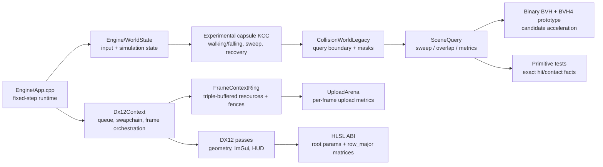
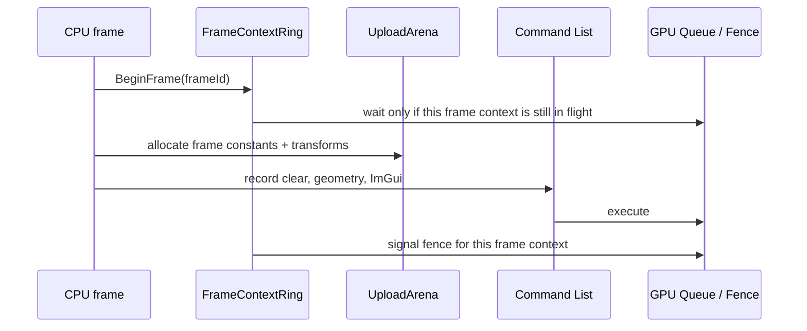
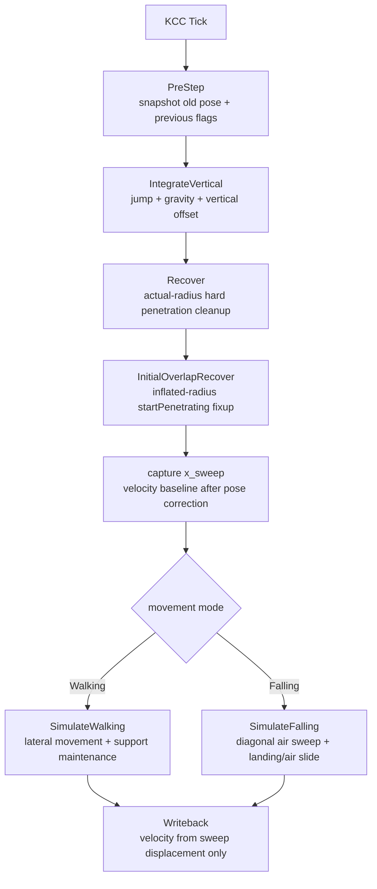
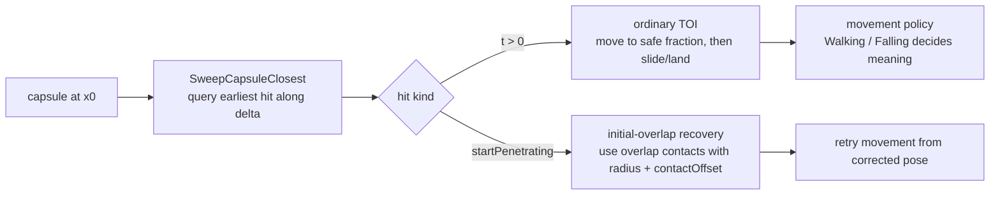
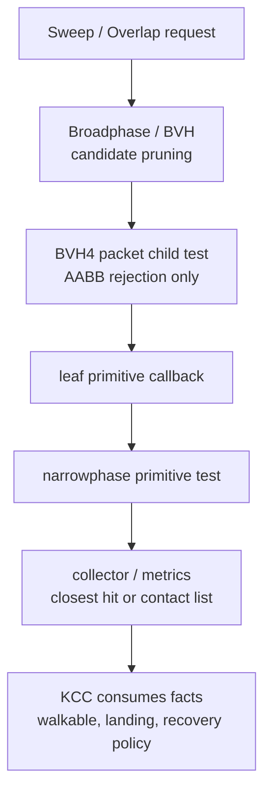

# DX12EngineLab

**C++17 / DirectX12 engine lab for explicit GPU resource lifetime, real-time
rendering diagnostics, and custom collision / KCC systems.**

DX12EngineLab is a Windows / DirectX12 engine sandbox built around two hard
engineering threads:

1. making low-level rendering lifetime visible and debuggable; and
2. building enough collision / SceneQuery infrastructure to reason about capsule
   character movement bugs instead of treating them as black-box physics.

[](assets/media/demo-full.mp4)

**Demo capture:** inline 14s loop from the engine demo.  
Full capture: [60s 720p MP4](assets/media/demo-full.mp4)


```mermaid
flowchart LR
    App["Engine/App.cpp\nfixed-step runtime"] --> World["Engine/WorldState\ninput + simulation state"]
    World --> KCC["Experimental capsule KCC\nwalking/falling, sweep, recovery"]
    KCC --> CW["CollisionWorldLegacy\nquery boundary + masks"]
    CW --> SQ["SceneQuery\nsweep / overlap / metrics"]
    SQ --> BVH["Binary BVH + BVH4 prototype\ncandidate acceleration"]
    SQ --> NP["Primitive tests\nexact hit/contact facts"]

    App --> DX12["Dx12Context\nqueue, swapchain, frame orchestration"]
    DX12 --> Frame["FrameContextRing\ntriple-buffered resources + fences"]
    DX12 --> GPU["DX12 passes\ngeometry, ImGui, HUD"]
    Frame --> Upload["UploadArena\nper-frame upload metrics"]
    GPU --> Shader["HLSL ABI\nroot params + row_major matrices"]
```

## What This Project Shows

| Area | What is demonstrated | Evidence |
|---|---|---|
| DX12 frame lifetime | triple-buffered frame contexts, command allocator reuse, fence ownership | `Renderer/DX12/FrameContextRing.*`, `Renderer/DX12/Dx12Context.*` |
| GPU resource ownership | UploadArena metrics, descriptor ring reuse, resource-state tracking | `Renderer/DX12/UploadArena.*`, `Renderer/DX12/DescriptorRingAllocator.*`, `Renderer/DX12/ResourceStateTracker.*` |
| Shader / CPU contract | root parameter enum mirrored by HLSL registers, explicit `row_major` matrices | `Renderer/DX12/ShaderLibrary.h`, `shaders/common.hlsli` |
| Real-time demo path | 10,000-cube instancing / naive draw toggle, ImGui HUD, runtime controls | `Renderer/DX12/GeometryPass.h`, `Renderer/DX12/ToggleSystem.h`, `Renderer/DX12/ImGuiLayer.*` |
| Runtime systems | fixed-step simulation, action state, camera/runtime HUD data | `Engine/App.cpp`, `Engine/WorldState.*`, `Renderer/DX12/Dx12Context.h` |
| Collision / KCC depth | capsule KCC, sweep/slide, initial-overlap recovery, walking/falling split | `Engine/Collision/KinematicCharacterControllerLegacy.*`, `Engine/Collision/CctTypes.h` |
| SceneQuery / BVH | closest sweep, overlap contacts, 4-backend correctness cross-check, BVH4 scalar/SIMD prototype | `Engine/Collision/SceneQuery/`, `docs/audits/scenequery/` |

The point is to show engine-system ownership: explicit GPU lifetime on the
rendering side, and evidence-driven collision contracts on the runtime side.

## Engineering Problems And Solutions

### 1. Explicit GPU frame lifetime

DirectX12 does not hide command allocator, upload-buffer, descriptor, or resource
state lifetime. This repo makes those boundaries explicit instead of relying on
a framework.

| Problem | Local solution | Evidence |
|---|---|---|
| Reusing a command allocator before the GPU is finished corrupts frame state. | `FrameContextRing` selects frame resources by monotonic frame id and gates reuse with fences. | `Renderer/DX12/FrameContextRing.h`, `Renderer/DX12/FrameContextRing.cpp` |
| Per-frame upload allocation is easy to misuse if it is invisible. | `UploadArena` records allocation calls, bytes, peak offset, capacity, and last allocation tag for HUD diagnostics. | `Renderer/DX12/UploadArena.h`, `Renderer/DX12/UploadArena.cpp` |
| Dynamic descriptors need a clear lifetime owner. | `DescriptorRingAllocator` owns shader-visible descriptor reuse and retirement. | `Renderer/DX12/DescriptorRingAllocator.*` |
| Resource barriers become noisy and error-prone when spread across passes. | `ResourceStateTracker` centralizes state transitions and skips redundant barriers. | `Renderer/DX12/ResourceStateTracker.*`, `Renderer/DX12/BarrierScope.h` |


```mermaid
sequenceDiagram
    participant CPU as CPU frame
    participant Ring as FrameContextRing
    participant Upload as UploadArena
    participant Cmd as Command List
    participant GPU as GPU Queue / Fence

    CPU->>Ring: BeginFrame(frameId)
    Ring->>GPU: wait only if this frame context is still in flight
    CPU->>Upload: allocate frame constants + transforms
    CPU->>Cmd: record clear, geometry, ImGui
    Cmd->>GPU: execute
    Ring->>GPU: signal fence for this frame context
```

### 2. Shader ABI as an engine contract

The renderer treats CPU root parameters and HLSL registers as an ABI. The shader
side documents the root slots and uses `row_major` matrices so CPU-side matrix
layout does not depend on implicit transpose assumptions.

| CPU side | HLSL side | Purpose |
|---|---|---|
| `RP_FrameCB` | `b0 space0` | frame constants, including `ViewProj` |
| `RP_TransformsTable` | `t0 space0` | transform `StructuredBuffer` descriptor table |
| `RP_InstanceOffset` | `b1 space0` | root constant for naive draw instance offset |
| `RP_DebugCB` | `b2 space0` | debug color mode constants |

Evidence: `Renderer/DX12/ShaderLibrary.h`, `shaders/common.hlsli`.

### 3. Collision: rebuilding a solver on pinned semantics

**Lineage.** The first controller was a hand-rolled AABB axis-separated push-out
(`docs/contracts/day3/`), patched with MTV resolution, then replaced by a capsule
sweep/slide controller in the Quake lineage — `MAX_BUMPS = 4`, `OVERCLIP = 1.001`,
`ClipVelocity`, researched from Quake III `bg_slidemove.c` and `SV_FlyMove`
(`docs/notes/sweep_capsule.md`). It worked — until seam contacts and wall-climb
upward pops exposed the real disease: one `Hit.normal` was being consumed as four
different things — raw geometry, movement response, floor support, and recovery
(`docs/audits/kcc/01-wall-climb-upward-pop-fixability.md`).

**Diagnosis before patching.** Instead of patching the symptom, the solver was
frozen and audited: 12 written audits in three days (`docs/audits/kcc/`). The
diagnosis (audit 02) was that the bug was not numeric — movement semantics were
mixed. Gravity accumulation doubled as a stair trigger, `StepDown` was doing eight
jobs with one distance value, and `onGround` served as both execution policy and
result state.

**Contract mining, two engines.** PhysX 4.0 geometry/query/CCT source was read and
distilled into 13 contract cards with file:line anchors, each marked
raw-source-verified (`docs/reference/physx/contracts/`); Unreal CharacterMovement
source into 4 movement-policy cards (`docs/reference/unreal/contracts/`). The split
is the point: PhysX answers geometry-contract questions (what a sweep distance
means, what an initial overlap reports), Unreal answers policy questions (what
counts as a floor, when landing is valid). One mirror made the local bug obvious:
PhysX refuses to report a geometric normal for an initial overlap — it returns
`distance = 0` with the synthetic `normal = -unitDir` — while the local solver had
been consuming exactly such raw normals as movement response
(`docs/reference/physx/contracts/sweep-toi-hit-normal.md`). The same card/audit
pipeline is also how AI tooling was kept inside architectural boundaries during
this work (`AGENTS.md`).

**The rebuild.** The solver was re-solved stage by stage with each semantic pinned:
`CctMoveMode { Walking, Falling }` as the single policy authority, typed floor
semantics (`CctFloorSource` / `CctFloorSemantic`), a per-stage `SweepFilter`,
pose-only recovery that never feeds velocity, and velocity written back from sweep
displacement only.


```mermaid
flowchart TD
    Tick["KCC Tick"] --> Pre["PreStep\nsnapshot old pose + previous flags"]
    Pre --> Vertical["IntegrateVertical\njump + gravity + vertical offset"]
    Vertical --> Recover["Recover\nactual-radius hard penetration cleanup"]
    Recover --> Initial["InitialOverlapRecover\ninflated-radius startPenetrating fixup"]
    Initial --> Baseline["capture x_sweep\nvelocity baseline after pose correction"]
    Baseline --> Mode{"movement mode"}
    Mode -->|Walking| Walk["SimulateWalking\nlateral movement + support maintenance"]
    Mode -->|Falling| Fall["SimulateFalling\ndiagonal air sweep + landing/air slide"]
    Walk --> Write["Writeback\nvelocity from sweep displacement only"]
    Fall --> Write
```

The hard-won artifact of the rebuild — not all normals mean the same thing:

| Normal / result kind | Meaning | Who should consume it |
|---|---|---|
| sweep TOI normal | blocking surface reached during motion | movement stage, slide, landing check |
| initial-overlap result | movement started inside inflated contact band | recovery path, not slide/landing |
| overlap contact normal | current penetration/support fact | recovery or floor support, not ordinary sweep TOI |
| walkable floor normal | candidate ground slope | floor/landing policy, not raw SceneQuery |

The honest coda: the old speculative StepUp was deleted, and its planned reactive
replacement was deliberately never built — pinning semantics alone eliminated the
visible bug set. Remaining work (floor quality, perch/edge, step-up) is gated on
concrete repro traces (`docs/audits/kcc/13-post-initial-mtd-remaining-work.md`).
The retired first-generation solver is preserved at tag `pre-kcc-migration`.

**The math, made explicit.** A capsule is a segment ⊕ sphere (a Minkowski sum).
The capsule-vs-triangle TOI query therefore reduces to sweeping a *sphere* against
the triangle extruded along the capsule's half-segment — a CSO construction,
implemented in `BuildExtrudedFaces7` (one end cap + three edge quads = 7 prism
faces) and `SweepCapsuleTri_PhysXLike_TOI01`
(`Engine/Collision/SceneQuery/SqNarrowphaseLegacy.h`), following PhysX's
extrusion approach. Degenerate capsules fall back to sphere sweeps; a colinear
shortcut handles axis-parallel motion. Underneath sit explicit distance kernels
(`DistSegmentTriangleSq`, `DistSegmentSegmentSq` — `SqDistance.h`), a TOI
tie-break cascade, and packed feature ids. The book layer: Christer Ericson,
*Real-Time Collision Detection* (read in full) for primitive tests and closest
points; Erin Catto's TOI/shape-cast material; van den Bergen for the convex-query
vocabulary (a generic GJK backend is a future direction, not current code).


```mermaid
flowchart LR
    Start["capsule at x0"] --> Sweep["SweepCapsuleClosest\nquery earliest hit along delta"]
    Sweep --> Normal{"hit kind"}
    Normal -->|t > 0| TOI["ordinary TOI\nmove to safe fraction, then slide/land"]
    Normal -->|startPenetrating| MTD["initial-overlap recovery\nuse overlap contacts with radius + contactOffset"]
    MTD --> Retry["retry movement from corrected pose"]
    TOI --> Policy["movement policy\nWalking / Falling decides meaning"]
```

### 4. SceneQuery: a correctness harness, not a benchmark

`SceneQuery` is the boundary for raw geometric facts, kept separate from movement
policy. Because the BVH4/SIMD traversal is easy to get subtly wrong, it is not
trusted: four backends (LinearFallback / BinaryBVH / ScalarBVH4 / SimdBVH4) run
the same deterministic query set and are cross-checked at startup. Hit
equivalence is tolerance-based (`t` 1e-5, depth 1e-4, normal dot ≥ 0.999) against
the linear oracle; an adversarial case deliberately overflows the contact
capacity to prove all four backends retain the same deterministic contact set;
and ~20 per-query cost counters (nodes popped, AABB tests, packet lanes,
narrowphase calls) expose traversal work
(`Engine/Collision/SceneQuery/SqBackendHarness.*`, `SqMetrics.h`).


```mermaid
flowchart TD
    Query["Sweep / Overlap request"] --> Broad["Broadphase / BVH\ncandidate pruning"]
    Broad --> Child["BVH4 packet child test\nAABB rejection only"]
    Child --> Leaf["leaf primitive callback"]
    Leaf --> Narrow["narrowphase primitive test"]
    Narrow --> Collector["collector / metrics\nclosest hit or contact list"]
    Collector --> KCC["KCC consumes facts\nwalkable, landing, recovery policy"]
```

Production queries run BinaryBVH (`Engine/Collision/SceneQuery/SqQueryLegacy.h`);
the BVH4 scalar and SIMD packet paths are measured prototypes behind the harness
(`Engine/Collision/SceneQuery/SqBVH4.h`). No speedup is claimed — ns/query is
reported as a reference measurement only, and the claim boundary is documented in
`docs/audits/scenequery/12-bvh4-simd-soa-traversal-hardening.md`.

## Demo Evidence

Current curated media:

- `assets/media/demo-main.gif`: 720x405, 14-second inline README loop showing
  edge contact, character movement, HUD diagnostics, and SceneQuery/KCC debug
  visualization.
- `assets/media/demo-main.png`: 1280x720 still fallback for portfolio/PDF links.
- `assets/media/demo-full.mp4`: 1280x720, 16:9, about 63 seconds.

## Controls

| Key | Behavior |
|---|---|
| `T` | Toggle instanced / naive draw mode |
| `U` | Toggle UploadArena diagnostics |
| `C` | Cycle color mode |
| `G` | Toggle grid |
| `V` | Toggle camera mode |
| `WASD` | Move |
| `Shift` | Sprint |
| `Space` | Jump |
| `F10` | Toggle capsule wireframe debug visualization |

## Build And Run

### Requirements

- Windows
- Visual Studio 2022
- Windows SDK
- DirectX 12 capable GPU/driver

### Build

```bash
msbuild DX12EngineLab.sln /m /p:Configuration=Debug /p:Platform=x64
msbuild DX12EngineLab.sln /m /p:Configuration=Release /p:Platform=x64
```

`.github/workflows/build.yml` runs Debug and Release x64 builds on
`windows-latest` for push and pull request events.

### Run

Open `DX12EngineLab.sln`, select `x64 / Debug`, and run with F5.

## Repository Map

| Path | Purpose |
|---|---|
| `Renderer/DX12/` | DX12 renderer, frame contexts, descriptors, resource states, passes, and diagnostics |
| `shaders/` | HLSL shaders and shared root-signature ABI documentation |
| `Engine/` | app loop, fixed-step runtime, world state, math, and collision integration |
| `Engine/Collision/` | experimental capsule KCC, CollisionWorld, SceneQuery, BVH, primitive tests |
| `Engine/Collision/SceneQuery/` | sweep/overlap query paths, metrics, BVH4 prototype, backend harness |
| `assets/scenes/` | runtime scene data |
| `assets/media/` | curated public demo media |
| `docs/onboarding/` | renderer architecture and frame-lifecycle notes |
| `docs/reference/physx/` | reviewed PhysX contract cards, not copied production code |
| `docs/reference/unreal/` | reviewed Unreal movement-policy contract cards |
| `docs/audits/` | local audit reports and deferred-work records |

## Evidence Artifacts

| Topic | Evidence |
|---|---|
| frame lifecycle | `docs/onboarding/20-frame-lifecycle.md`, `Renderer/DX12/FrameContextRing.*` |
| resource ownership | `docs/onboarding/30-resource-ownership.md`, `Renderer/DX12/ResourceStateTracker.*` |
| shader binding ABI | `docs/onboarding/40-binding-abi.md`, `shaders/common.hlsli` |
| UploadArena | `docs/onboarding/50-uploadarena.md`, `Renderer/DX12/UploadArena.*` |
| KCC stop point | `docs/audits/kcc/13-post-initial-mtd-remaining-work.md` |
| PhysX sweep / MTD semantics | `docs/reference/physx/contracts/sweep-toi-hit-normal.md`, `docs/reference/physx/contracts/initial-overlap-mtd.md` |
| PhysX CCT query/recovery mechanics | `docs/reference/physx/contracts/cct-query-recovery-mechanics.md` |
| PhysX BV4 traversal boundary | `docs/reference/physx/contracts/bv4-layout-traversal.md`, `docs/audits/scenequery/12-bvh4-simd-soa-traversal-hardening.md` |
| Unreal floor / perch / landing policy | `docs/reference/unreal/contracts/floor-find-perch-edge.md`, `docs/reference/unreal/contracts/character-movement-walking-floor-step.md` |

## Known Limitations

- This is an engine lab, not a production engine.
- Collision/KCC code is experimental and still being refined.
- The current public demo is an engine-system capture, not complete game
  content.
- BVH4/SIMD work is a correctness and metrics harness. It is not a claim of
  PhysX BV4 parity or proven runtime speedup.
- Floor/perch/edge semantics are documented as future KCC work, not complete
  behavior.

## Roadmap

- Expand deterministic SceneQuery benchmark cases before making performance
  claims.
- Resume KCC work from concrete repro traces; continue floor/perch/landing
  refinement as a separate movement-policy lane.
- BVH4 flattening, node quantization, and deeper SIMD traversal work.
- HUD close-up captures for UploadArena / frame metrics.
